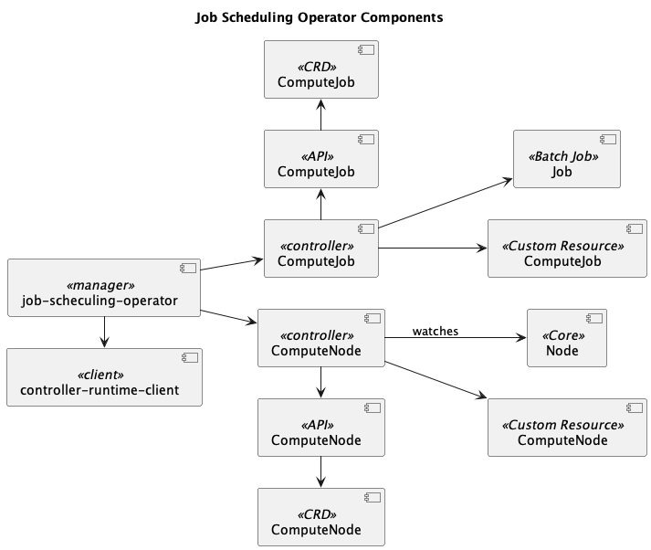

# job-scheduling-operator
This operator is responsible for scheduling batch jobs on existing declared nodes.

## Description
This project simulates a distributed job scheduling system. The operator should manage
compute nodes as Kubernetes Custom resource definition and handle the lifecycle of nodes and jobs within the system.

## Design and Implementation

### Design

* The purpose of this design is to support a job scheduling system on a preset set of k8s nodes.
* A set of assumptions I made were documented in [docs/ASSUMPTIONS.md](docs/ASSUMPTIONS.md).



**job-scheduling-operator**
K8s manager that embeds the core control loops shipped with Kubernetes.

**ComputeJob << controller >>**
Control loop that handle the desired state for ComputeJobs and their owned Batch Jobs.

**ComputeNode << controller >>**
Control loop that handle the desired state for ComputeNodes based on the current state of the k8s nodes they represent.

**ComputeJob << API >>**
Provides the Domain objects of ComputeJobs, which can be shared with other mechanisms that want to interact with this operator to use ComputeJobs.

**ComputeNode << API >>**
Provides the Domain objects of ComputeNodes, which can be shared with other mechanisms that want to interact with this operator to use ComputeNodes.

**ComputeJob << CRD >>**
Custom resource definition that model a custom ComputeJob resource.

**ComputeNode << CRD >>**
Custom resource definition that model a custom ComputeNode resource.

**ComputeJob << Custom Resource >>**
It is an instance of the ComputeJob CRD, created by an user and whose lifecycle is managed by the ComputeJob controller.

**Job << Batch Job >>**
It is a k8s batch job, owned by a ComputeJob resource. It is created by the ComputeJob controller based on the desired state described in the ComputeJob manifest. The ComputeJob controller watches these objects to verify if the desired state is the one specified in the ComputeJob.

**ComputeNode << Custom Resource >>**
It is an instance of the ComputeNode CRD, created by an user and whose lifecycle is managed by the ComputeNode controller

**Node << Core >>**
It is a k8s node resource. It is watched by the ComputeNode controller to update the status of the ComputeNode which references it. If the node changes its current state, the aforementioned controller will change the status in the ComputeNode resource as well.

Find below some nuances of the logic of this operator.

* This operator is for operation/platform teams in charge of handling the job scheduling system lifecycle for product teams.
* Product teams leverage on this operator to declare jobs they want to run in the system.
* This project represents an operator which handle 2 controllers: ComputeNode and ComputeJob, which are in charge of handling nodes and batch jobs.
* There are 2 CRDs, 1 for each controller to define ComputeNodes and ComputeJobs.
* The ComputeNode controller simply references an existing cluster node. This controller subscribes to K8S Server API to watch existing nodes.
* ComputeNode controller looks for a node referenced by the ComputeNode to update the ComputeNode state.
* The ComputeJob controller creates batch jobs based on the desired state declared in the ComputeJob custom resources. 
* ComputeJob assigns a node or a set of them to the batch job using Node Affinity based on the given CPU demand and the specific node name.


### Implementation
* I leveraged the Kubebuilder framework to have all the plumbing related to communicating with Kubernetes ready. On top of that, Kubebuilder provides tools to easily create, test, and deploy operators.
* For ComputeJob Controller I implemented a logic to execute commands based on the current state of ComputeNodes, ComputeJobs and Batch Jobs. It means that the reconciliation logic checks what the current state is and based on that, executes actions for Create Batch Jobs, Update ComputeJob State and Update Batch Job State.
* The ComputeNode controller is simpler than ComputeJob, for this I implemented a logic to check the current state of the referenced Node and based on that state I update the ComputeNode resource. Since there is only one action here, all the logic is part of the reconciliation function.
* I created an additional package `internal/jobs` to provide behaviour related to jobs.
* For unit testing I decided to use a more explicit approach, I like others can follow the logic for each unit test easily.
* In order to keep desired stated in ComputeJob Batch Jobs, ComputeJob controller compares ComputeJob Spec and if something is different the batch job is deleted and created again. I made this decision because updating running jobs is difficult and could lead to unexpected behavior.

## Getting Started

### Prerequisites
- go version v1.22.0+
- docker version 17.03+.
- kubectl version v1.11.3+.
- Access to a Kubernetes v1.11.3+ cluster.

### To Test this project

* To run unit tests.

```sh
make test
```

* To run end-to-end tests.

Make sure you are connected to your k8s cluster for testing. You can use a local k8s cluster using [kind](https://kind.sigs.k8s.io/docs/user/quick-start/#installation)

```sh
make test-e2e
```

### To run it locally without generating container images

Just in case you want to run the operator and subscribe it to your k8s current context.

* Make sure your are using the proper context.

```sh
kubectl config current-context
```

* Install CRDs

```sh
make install
```

* To run the operator from this project.

```sh
make run
```

* Create resources.

```sh
kubectl create -f config/samples/job-scheduling-operator_v1_computenode.yaml
```

### To Deploy on the cluster
**Build and push your image to the location specified by `IMG`:**

```sh
make docker-build docker-push IMG=<some-registry>/job-scheduling-operator:tag
```

**NOTE:** This image ought to be published in the personal registry you specified.
And it is required to have access to pull the image from the working environment.
Make sure you have the proper permission to the registry if the above commands don’t work.

**Install the CRDs into the cluster:**

```sh
make install
```

**Deploy the Manager to the cluster with the image specified by `IMG`:**

```sh
make deploy IMG=<some-registry>/job-scheduling-operator:tag
```

> **NOTE**: If you encounter RBAC errors, you may need to grant yourself cluster-admin
privileges or be logged in as admin.

**Create instances of your solution**
You can apply the samples (examples) from the config/sample:

```sh
kubectl apply -k config/samples/
```

>**NOTE**: Ensure that the samples has default values to test it out.

### To Uninstall
**Delete the instances (CRs) from the cluster:**

```sh
kubectl delete -k config/samples/
```

**Delete the APIs(CRDs) from the cluster:**

```sh
make uninstall
```

**UnDeploy the controller from the cluster:**

```sh
make undeploy
```

## Project Distribution

Following are the steps to build the installer and distribute this project to users.

1. Build the installer for the image built and published in the registry:

```sh
make build-installer IMG=<some-registry>/job-scheduling-operator:tag
```

NOTE: The makefile target mentioned above generates an 'install.yaml'
file in the dist directory. This file contains all the resources built
with Kustomize, which are necessary to install this project without
its dependencies.

2. Using the installer

Users can just run kubectl apply -f <URL for YAML BUNDLE> to install the project, i.e.:

```sh
kubectl apply -f https://raw.githubusercontent.com/<org>/job-scheduling-operator/<tag or branch>/dist/install.yaml
```

## Make command

**NOTE:** Run `make help` for more information on all potential `make` targets

More information can be found via the [Kubebuilder Documentation](https://book.kubebuilder.io/introduction.html)

## License

Copyright 2024.

Licensed under the Apache License, Version 2.0 (the "License");
you may not use this file except in compliance with the License.
You may obtain a copy of the License at

    http://www.apache.org/licenses/LICENSE-2.0

Unless required by applicable law or agreed to in writing, software
distributed under the License is distributed on an "AS IS" BASIS,
WITHOUT WARRANTIES OR CONDITIONS OF ANY KIND, either express or implied.
See the License for the specific language governing permissions and
limitations under the License.

